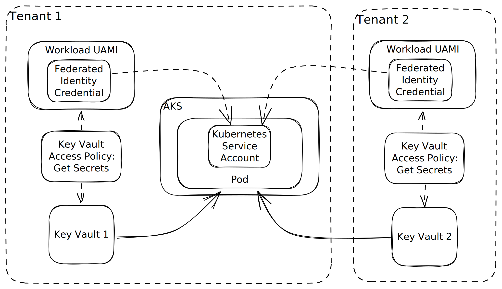

# AKS Multitenant with Workload Identity Sample
Sample of how to use AKS Workload Identity across multiple AAD tenants

## Prerequisites
- Two [Azure Active Directory](https://learn.microsoft.com/en-us/azure/active-directory/fundamentals/active-directory-whatis) tenants (**not B2C tenants**)
- [Subscriptions and Azure CLI](https://azure.microsoft.com/en-us/get-started/)
- [Terraform](https://developer.hashicorp.com/terraform/downloads)
- [Terragrunt](https://terragrunt.gruntwork.io/docs/getting-started/install/)
- Make sure that your account has access to both tenants (you would need to be a guest in the second tenant) or that you properly configure both service principals for terraform use (outside the scope of this repo)
- Set your default subscription using `az account set -n SUBSCRIPTION_ID`. We will be using `SUBSCRIPTION_ID2` as secondary subscription.

## Creating infrastructure
A few variables might be required and not provided by default in these modules. To avoid having to pass the value every time, simple create a terraform.tfvars file in each module that requires these variables. The main ones are:
- keyvault/terraform.tfvars:
```sh
key_vault_name = "your-keyvault-name-testkv"
```
- keyvault2/terraform.tfvars:
```sh
subscription_id = "SUBSCRIPTION_ID2"
tenant_id = "TENANT_ID2"
key_vault_name = "your-keyvault-name-testkv2"
```
- apps/terraform.tfvars:
```sh
subscription_id = "SUBSCRIPTION_ID"
tenant_id = "TENANT_ID"
subscription_id = "SUBSCRIPTION_ID2"
tenant_id = "TENANT_ID2"
```

Then, run the following command:
```sh
terragrunt run-all apply --auto-approve
```

## Azure Active Directory (AAD) and Multitenancy

This sample specifically showcases how to use Azure RBAC to access resources securely across AAD tenants. This is accomplished by creating Federated Identity Credentials in managed identities that map to a workload's kubernetes service account (k8s identity). This enables the workload to identify itself as said managed identities when needed. The two only parameters that the workload needs to use are the UAMI (User Assigned Managed Identity) Client ID and Tenant ID.

In this sample, the workload is able to access Azure Key Vaults across tenants without handling credentials. The setup leverages Terraform (IaC) to create identities, map them to the k8s service account and inject the Client ID and Tenant ID. Said workload can then use one identity to obtain credentials across tenants and access Azure resources safely. The diagram below shows the simple setup created by executing the command `terragrunt run-all apply --auto-approve`.




## Testing Workload Identity Access

First, get the credentials to the cluster in your machine:
```sh
cd aks
$(terragrunt output -raw cluster_credentials_command)
cd ..
```
Now run a command that should print the value of the key vault secrets to console (if it does, this means that the k8s service account can access keyvaults across tenants using Workload Identity). The default value for the secrets are `AKSWIandKeyVaultIntegrated!` and `AKSWIandKeyVaultIntegrated 2!`.
```sh
cd apps
$(terragrunt output -raw print_key_vault_secret_command)
$(terragrunt output -raw print_key_vault_secret_command2)
cd ..
```
Enjoy.