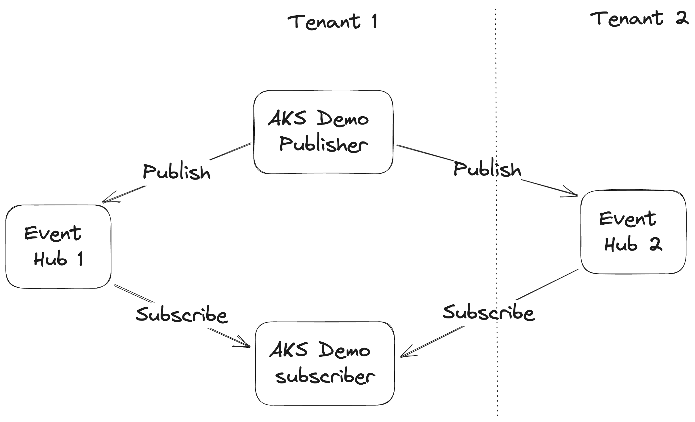

#Flow of demo apps



## Prerequisities

1. Create two tenant environments and their subscriptions.
2. Az login into the tenant1 and set the subscription.
      ```terraform
          az login 
          az account set --subscription <subscription_id1>
      ```

## Set up infrastructure

Create `terraform.tfvars` with the tenant and subscription values for the tenant1 and tenant2 created from prerequisites 
section.

```terraform
tenant_id = "<tenant_id>"
tenant_id2 = "<tenant_id2>"
subscription_id = "<subscription_id1>"
subscription_id2 = "<subscription_id2>"
```

Navigate to `demo/terraform` and execute the following commands

```
terraform init
terraform plan
terraform apply --auto-approve
```

## Validation

Messages from tenant1 applications are successfully produced and consumed in tenant1 and tenant2.